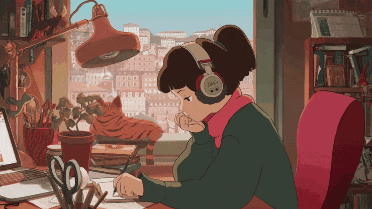

  

#

 Hi i'm Arc! 
Professional with a strong interest in Programming, Photography, and Music fields that foster creativity and innovation. I focus on developing efficient and original solutions, while continuously learning and staying open to new challenges and collaborations.

#

<h3 align="left">𝙲𝚘𝚗𝚝𝚊𝚌𝚝𝚜</h3>

<h3 align="left">𝙼𝚢 𝚂𝚝𝚊𝚌𝚔</h3>

#
  <!-- GitHub Stats -->

  <h3>𝚂𝚝𝚊𝚝𝚜</h3>
  

  

 

<picture align="center">
  <source media="(prefers-color-scheme: dark)" srcset="https://raw.githubusercontent.com/mari4souza/mari4souza/output/github-contribution-grid-snake-dark.svg">
  <source media="(prefers-color-scheme: light)" srcset="https://raw.githubusercontent.com/mari4souza/mari4souza/output/github-contribution-grid-snake-dark.svg">
  
</picture>

